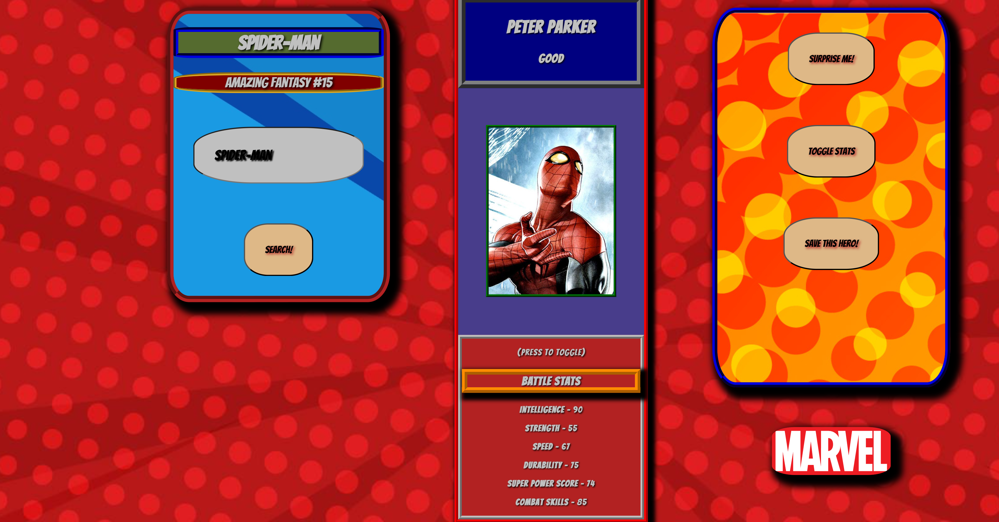
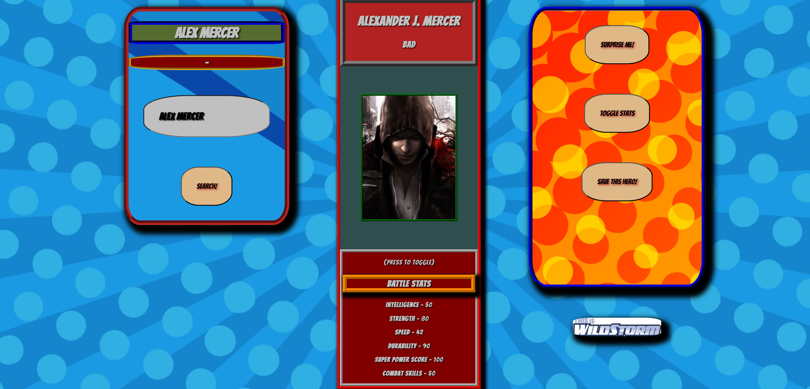
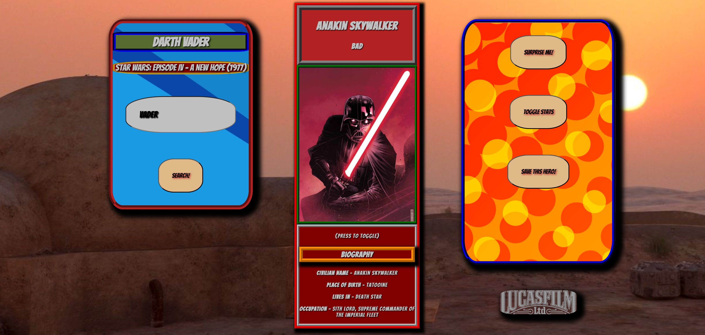
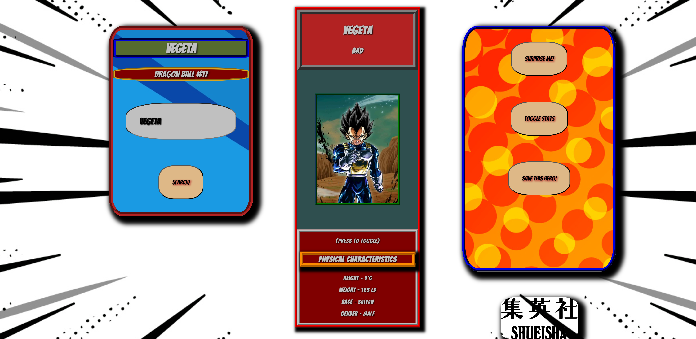
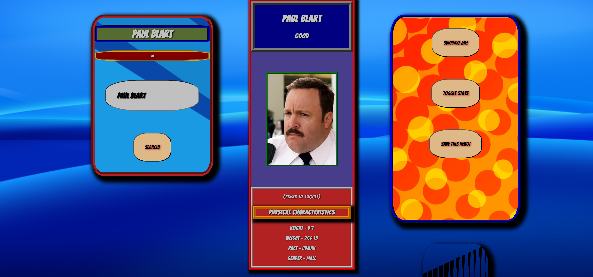

# We Need a Hero!

Personal HTML project by Jordan Johnson-Carter

This website utilizes Akshay Baweja's [Superhero API](https://superheroapi.com/api/) to pull images and data from over 700 superheroes, supervillains, superpowered- supertenacious, and other enigmas!

See how they measure up, but if that doesn't interest you, you can swap between their fighting prowess and their physical characteristics and tidbits on their biography.

Even figurative superheroes (Paul Blart?)

From Marvel and DC, to Dark Horse Comics, NBC heroes, Manga, Star Trek, Star Wars, and many more. They're strong, they're fast, and they're fresh from the fight!

## Credits

[Superhero API](https://superheroapi.com/api/) - Akshay Baweja - [Website](https://akshaybaweja.com/) - [linkedin](https://www.linkedin.com/in/akshaybaweja/)
* Wireframe placeholder art - Dan Hipp - [Instagram](https://www.instagram.com/danhipp/)

### Background attribution
#### [Freepik](https://www.freepik.com/author/freepik)
* Red Background 
* Cosmic Background 
* Manga Background 

#### alicia-mb - [Freepik](https://www.freepik.com/author/alicia-mb)
* Comic dots 
* Comic dots blue 

#### pikisuperstar - [Freepik](https://www.freepik.com/author/pikisuperstar)
* Mixed (Default) background
#### dgim-studio - [Freepik](https://www.freepik.com/author/dgim-studio)
* blue Background
#### Starline - [Freepik](https://www.freepik.com/author/starline)
* Orange Background #1 
#### [Pngtree](https://pngtree.com)
* [Orange Background #2](https://pngtree.com/freebackground/pop-style-halftone-background_1442148.html)

This can all be found in the "background-attributions" text files